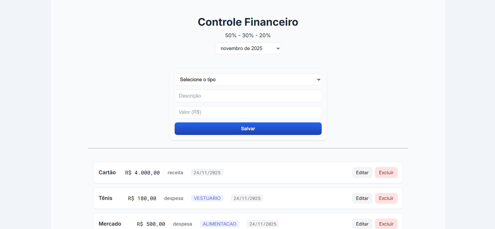
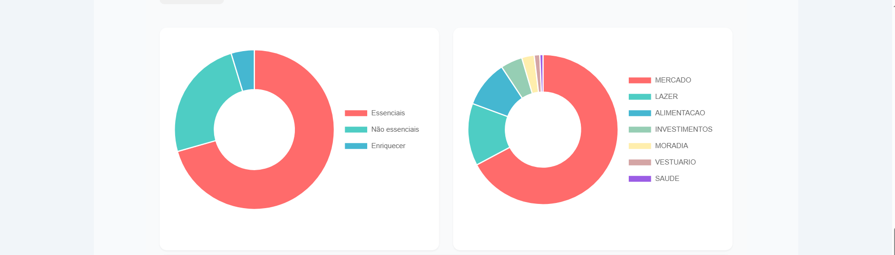
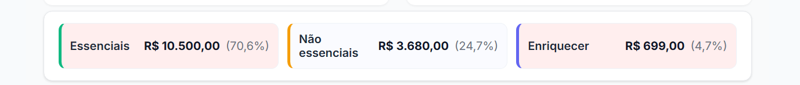
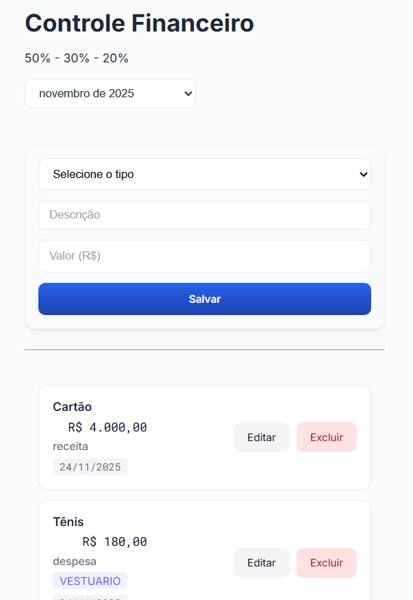

# 💰 Sistema de Controle Financeiro

Sistema completo para gestão de finanças pessoais baseado no método 50/30/20, desenvolvido com Spring Boot e Angular.

## 📋 Descrição

Aplicação web para controle financeiro pessoal que permite gerenciar receitas e despesas, visualizar gastos por categoria através de gráficos interativos e acompanhar o cumprimento das metas financeiras baseadas no método 50/30/20.

### Funcionalidades Principais

- ✅ Cadastro de receitas e despesas
- ✅ Categorização automática de gastos
- ✅ Gráficos interativos de despesas
- ✅ Acompanhamento mensal com histórico de 12 meses
- ✅ Alertas visuais quando ultrapassa as metas do plano 50/30/20
- ✅ Visualização de saldo e totalizadores
- ✅ Edição e exclusão de transações
- ✅ Interface responsiva (mobile-first)

### Método 50/30/20

O sistema implementa o popular método de orçamento 50/30/20:

- **50% Essenciais**: Moradia, Saúde, Contas e Mercado
- **30% Não-essenciais**: Alimentação, Transporte, Lazer, Vestuário, Compras, Outros
- **20% Enriquecer**: Educação, Reserva, Investimentos

Quando você ultrapassa essas metas, o sistema exibe alertas visuais em vermelho suave.

## 🚀 Tecnologias Utilizadas

### Backend
- **Java 17**
- **Spring Boot 3.5.6**
- **Spring Data JPA**
- **MySQL 8.0**
- **Maven**
- **Lombok**

### Frontend
- **Angular 20**
- **TypeScript**
- **Chart.js 4.5.1** (gráficos)
- **RxJS**
- **CSS3** (design responsivo)

## 📸 Screenshots

### 🎥 Demonstração em Vídeo

> **📹 [Clique aqui para assistir o vídeo demo completo](https://www.loom.com/share/SEU-LINK-AQUI)**


*GIF demonstrando as principais funcionalidades do sistema*

### 📊 Interfaces

### Tela Principal


### Gráficos de Despesas


### Alertas de Meta


### Versão Mobile


## ⚙️ Pré-requisitos

Antes de começar, certifique-se de ter instalado:

- **Java JDK 17** ou superior
- **Node.js 18** ou superior
- **npm** ou **yarn**
- **MySQL 8.0** ou superior
- **Maven 3.8+**
- **Git**

## 🔧 Instalação e Configuração

### 1. Clone o repositório

```bash
git clone https://github.com/paulogomes992/sistema-financeiro.git
cd sistema-financeiro
```

### 2. Configure o Banco de Dados

Crie um banco de dados MySQL:

```sql
CREATE DATABASE financeiro;
```

Edite o arquivo `src/main/resources/application.properties` com suas credenciais:

```properties
spring.datasource.url=jdbc:mysql://localhost:3306/financeiro?allowPublicKeyRetrieval=true&useSSL=false&createDatabaseIfNotExist=true
spring.datasource.username=seu_usuario
spring.datasource.password=sua_senha
```

### 3. Execute o Backend (Spring Boot)

```bash
# Compile e rode o backend
mvn clean install
mvn spring-boot:run
```

O backend estará rodando em: `http://localhost:8080`

### 4. Execute o Frontend (Angular)

```bash
# Entre na pasta do frontend
cd controle-financeiro

# Instale as dependências
npm install

# Execute o servidor de desenvolvimento
ng serve
```

O frontend estará rodando em: `http://localhost:4200`

## 🎯 Como Usar

1. **Acesse a aplicação**: Abra seu navegador em `http://localhost:4200`

2. **Adicione uma receita**:
   - Preencha a descrição, valor
   - Selecione o tipo "RECEITA"
   - Clique em "Adicionar"

3. **Adicione despesas**:
   - Preencha descrição e valor
   - Selecione tipo "DESPESA"
   - Escolha a categoria (Moradia, Saúde, Alimentação, etc.)
   - Clique em "Adicionar"

4. **Visualize os gráficos**:
   - Gráfico de subcategorias (Essenciais, Não-essenciais, Enriquecer)
   - Gráfico de categorias detalhadas
   - Resumo com valores e percentuais

5. **Acompanhe as metas**:
   - Se os gastos Essenciais ultrapassarem 50%, verá um alerta vermelho
   - Se os Não-essenciais ultrapassarem 30%, verá um alerta
   - Se o Enriquecer for menor que 20%, verá um alerta

6. **Navegue entre meses**:
   - Use o seletor no topo para ver histórico de até 12 meses

## 📁 Estrutura do Projeto

```
sistema-financeiro/
├── src/                          # Backend Spring Boot
│   ├── main/
│   │   ├── java/
│   │   │   └── com/sistema/financeiro/api/
│   │   │       ├── controllers/
│   │   │       ├── models/
│   │   │       ├── services/
│   │   │       └── exception/
│   │   └── resources/
│   │       └── application.properties
│   └── test/
├── controle-financeiro/          # Frontend Angular
│   ├── src/
│   │   ├── app/
│   │   │   ├── components/
│   │   │   │   ├── transacoes/
│   │   │   │   ├── header/
│   │   │   │   ├── transacao-form/
│   │   │   │   ├── transacao-list/
│   │   │   │   └── grafico/
│   │   │   └── services/
│   │   └── styles.css
│   ├── angular.json
│   └── package.json
├── pom.xml
└── README.md
```

## 🌐 API Endpoints

### Transações

| Método | Endpoint | Descrição |
|--------|----------|-----------|
| GET | `/api/transacoes` | Lista todas as transações |
| GET | `/api/transacoes/{id}` | Busca transação por ID |
| POST | `/api/transacoes` | Cria nova transação |
| PUT | `/api/transacoes/{id}` | Atualiza transação |
| DELETE | `/api/transacoes/{id}` | Exclui transação |

### Exemplo de Request (POST)

```json
{
  "descricao": "Aluguel",
  "valor": 1500.00,
  "tipo": "DESPESA",
  "categoria": "MORADIA",
  "data": "2025-11-25"
}
```

## 🎨 Categorias Disponíveis

### Despesas
- **Essenciais**: Moradia, Saúde, Contas, Mercado
- **Não-essenciais**: Alimentação, Transporte, Lazer, Vestuário, Compras, Outros
- **Enriquecer**: Educação, Reserva, Investimentos

### Receitas
- Salário, Freelance, Investimentos, etc.

## 🤝 Contribuindo

Contribuições são sempre bem-vindas!

1. Fork o projeto
2. Crie uma branch para sua feature (`git checkout -b feature/MinhaFeature`)
3. Commit suas mudanças (`git commit -m 'Adiciona MinhaFeature'`)
4. Push para a branch (`git push origin feature/MinhaFeature`)
5. Abra um Pull Request

## 📝 Licença

Este projeto está sob a licença MIT. Veja o arquivo [LICENSE](LICENSE) para mais detalhes.

## 👤 Autor

**Paulo Gomes**
- GitHub: [@paulogomes992](https://github.com/paulogomes992)

## Agradecimentos

- Método 50/30/20 para organização financeira
- Comunidade Spring Boot e Angular
- Chart.js pela biblioteca de gráficos

---

⭐ Se este projeto te ajudou, considere dar uma estrela!
